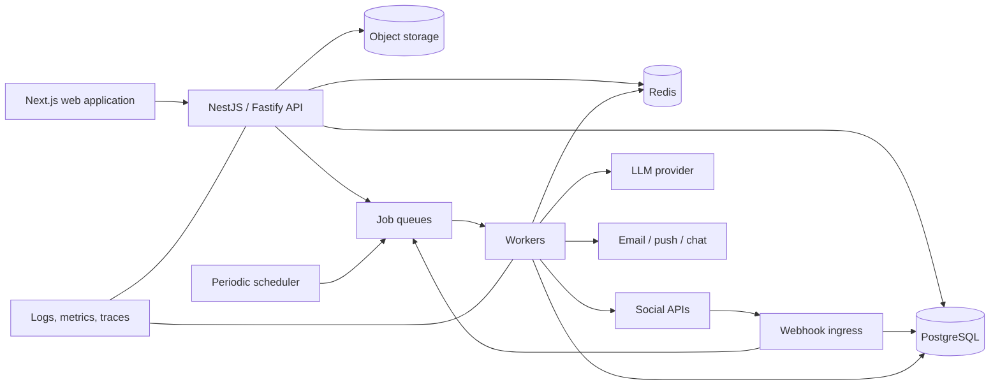
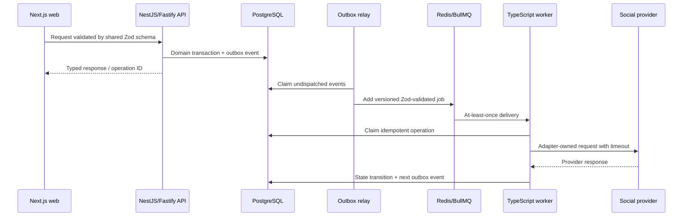
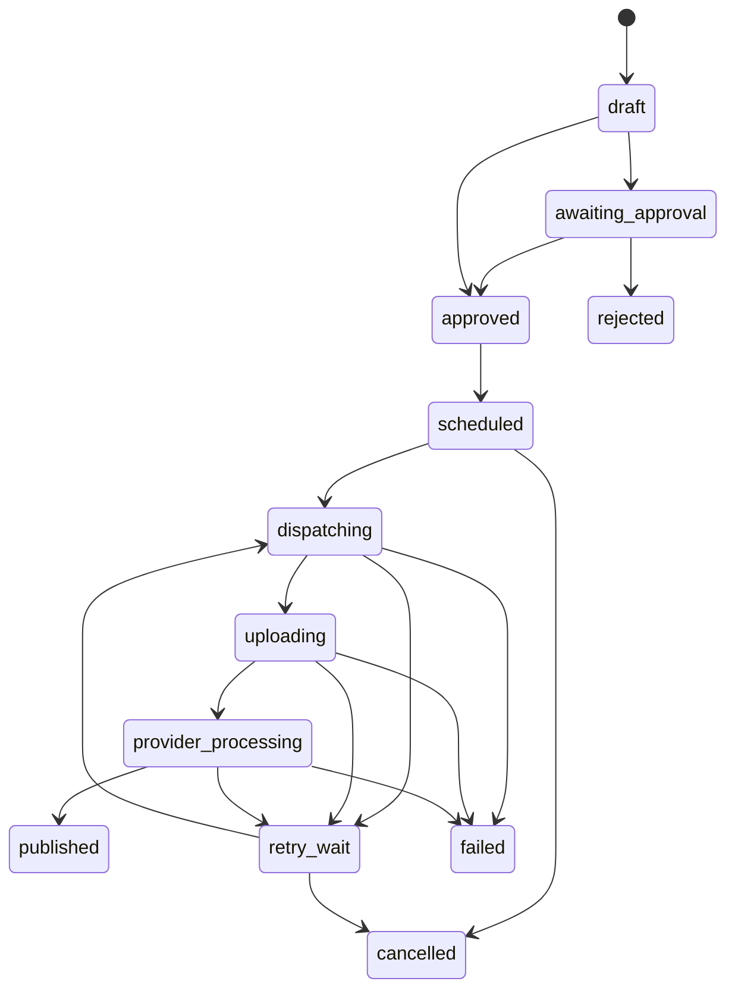

# Creator Operations Platform — TypeScript-First Product and Engineering Blueprint

**Document status:** implementation-ready architecture plan  
**Last verified:** 16 September 2026  
**Implementation status:** no application code has been created

## 1. Product definition

The product is a multi-tenant operations hub for creators, creator teams, and agencies. A user connects one or more social accounts, prepares content once, adapts it per network, schedules publication, tracks normalized performance, receives engagement-change alerts, and asks an AI assistant to propose repurposing actions.

The engineering goal is not merely a social-media dashboard. It is a TypeScript-first integration platform that handles expiring credentials, inconsistent provider models, long-running media uploads, duplicate webhook delivery, quota limits, eventually consistent analytics, retries, and partial platform outages. The same compiled artifacts and service protocols should move from a developer laptop to production with configuration changes rather than application rewrites.

### Primary users

- Independent creators managing several channels.
- Creator teams with editors, managers, and approvers.
- Agencies managing multiple creator workspaces.

### Core user journeys

1. Create a workspace and invite team members.
2. Connect Instagram, YouTube, TikTok, LinkedIn, or X through OAuth.
3. Upload a media asset and create a canonical content item.
4. Create platform-specific variants and previews.
5. Schedule one or more publications in the creator's timezone.
6. Publish reliably, with visible progress and actionable failures.
7. Import post and account metrics on a rolling schedule.
8. Compare normalized performance across platforms.
9. Receive alerts for unusual growth, decline, or viral acceleration.
10. Generate repurposing suggestions and approve them before any publish action.

## 2. Scope

### MVP

- Email/password or managed identity authentication.
- Workspaces, memberships, and role-based access.
- OAuth connection lifecycle for two initial providers, recommended: YouTube and TikTok or Instagram.
- Media upload, canonical content, platform variants, draft/schedule/cancel.
- Reliable asynchronous publication.
- Metric collection and a normalized analytics dashboard API.
- In-app alerts plus one external channel, such as email.
- AI-generated repurposing suggestions with human approval.
- Audit log, structured logs, metrics, traces, and an operator replay path.

### Post-MVP

- Approval chains and content calendars shared across teams.
- Comment inbox and response workflows where provider access permits it.
- Benchmarking, cohort analytics, campaign tracking, and attribution.
- Automatic subtitle, clip, thumbnail, and aspect-ratio generation.
- Brand voice profiles and reusable prompt policies.
- Mobile push, Slack, Discord, and Microsoft Teams notifications.
- Agency billing, usage metering, and white-label reporting.

### Explicit non-goals for the first release

- Scraping or browser automation as a substitute for official APIs.
- Guaranteed identical features on every social platform.
- Fully autonomous publishing by an LLM.
- Real-time analytics when a provider supplies delayed or daily data.
- A data warehouse on day one; PostgreSQL is sufficient until query volume proves otherwise.

## 3. System context



### Recommended deployable units

| Unit | Responsibility | Scaling characteristic |
|---|---|---|
| API | User-facing REST API, OAuth callbacks, query endpoints | Horizontal, stateless |
| Webhook ingress | Signature verification, durable event capture, fast acknowledgement | Horizontal, latency-sensitive |
| Publish worker | Media transfer and provider publication workflows | Scale by queue depth; low concurrency per account |
| Sync worker | Account, post, and analytics collection | I/O-heavy; quota-aware |
| AI worker | Repurposing and content analysis | Cost- and concurrency-limited |
| Notification worker | In-app/email/chat delivery | Separate retry and dead-letter policies |
| Scheduler | Enqueues due publications and recurring sync jobs | One active leader or distributed lock |

Initially, API and webhook ingress run in the same NestJS/Fastify process. API, scheduler, and workers are separate entry points from one TypeScript codebase and one immutable container image. Worker replicas subscribe to different BullMQ queues so they can be scaled independently without changing domain code.

## 4. Technology choices

| Concern | Recommended choice | Notes |
|---|---|---|
| Runtime | Current active Node.js LTS | Pin the exact version in development, CI, and containers |
| Language | TypeScript with strict compiler options | One language across web, API, workers, contracts, and tooling |
| Package management | npm workspaces | One root `package-lock.json`; use `npm ci` in CI and images |
| Web | Next.js + React | Server-rendered dashboard with shared TypeScript contracts |
| API | NestJS with Fastify adapter | Dependency injection, modular boundaries, OpenAPI, Fastify performance |
| Validation/contracts | Zod | Runtime validation and inferred types for HTTP, jobs, events, and config |
| ORM/query layer | Drizzle ORM | SQL-oriented, strongly typed access without exposing DB rows as contracts |
| Migrations | Drizzle Kit with reviewed SQL | Expand/migrate/contract discipline for zero-downtime releases |
| Primary store | PostgreSQL 16+ | Source of truth, JSONB for provider extensions |
| Cache and coordination | Redis | Cache, locks, token buckets, short-lived OAuth state |
| Jobs | BullMQ | Redis-backed delayed jobs, retries, priorities, rate limiting, and events |
| Object storage | S3-compatible storage | Direct browser upload using short-lived signed URLs |
| HTTP client | Native `fetch`/Undici behind provider adapters | `AbortSignal`, explicit timeouts, pooling, and typed error mapping |
| Token encryption | Cloud KMS envelope encryption | Never store OAuth tokens in plaintext |
| Observability | OpenTelemetry + Prometheus + centralized logs | Carry correlation IDs into jobs and provider calls |
| Testing | Vitest + Supertest/Fastify inject + Testcontainers | Real PostgreSQL and Redis for integration tests |
| AI | Provider-neutral adapter; OpenAI Responses API as one implementation | Structured output and strict tool allowlist |

### Modular monolith first

Use an npm-workspaces monorepo, one application image, and one PostgreSQL cluster organized by domain modules. Do not begin with network microservices. The important separation is behavioral: API requests, publication jobs, metric syncs, and AI tasks have explicit contracts and are independently retryable and scalable. A measured operational or ownership need—not directory structure—should trigger a future service extraction.

Suggested modules:

```text
identity/       users, sessions, workspaces, membership, roles
connections/    OAuth state, encrypted credentials, provider accounts
media/          assets, upload sessions, metadata, transformations
content/        canonical items, variants, validation, approval
publishing/     schedules, attempts, provider publishing state machines
analytics/      metric ingestion, normalization, aggregation, baselines
alerts/         rules, anomaly evaluation, incidents, delivery
ai_ops/         brand context, suggestions, runs, tool policies
webhooks/       verification, inbox, deduplication, event dispatch
providers/      provider interface and per-platform adapters
audit/          immutable security and business event history
```

### Recommended npm workspace layout

```text
apps/
  api/                 NestJS/Fastify HTTP API and webhook ingress
  worker/              BullMQ consumers selected by queue configuration
  scheduler/           recurring-job registration and due-work dispatcher
  web/                 Next.js creator and operations dashboard
packages/
  contracts/           Zod HTTP, event, and job schemas; no persistence types
  config/              Zod-validated environment contract and feature flags
  database/            Drizzle schema, migrations, transaction helpers
  observability/       logging, metrics, tracing, correlation context
  providers/           provider ports, adapters, fixtures, error taxonomy
  security/            encryption, signatures, authorization primitives
  testing/             builders, containers, fakes, sanitized fixtures
  eslint-config/       shared boundary and correctness rules
infra/
  compose/             local protocol-compatible dependencies
  terraform/           or equivalent production infrastructure as code
```

Each domain module lives inside its owning application or an explicitly owned package. Packages must not become a dumping ground for business rules. Enforce dependency direction and cycle detection in lint/CI.

### Development-to-production parity

The design target is configuration-only promotion. The application artifact and runtime topology stay the same:

| Concern | Development | Staging/production | Invariant |
|---|---|---|---|
| Runtime | Pinned Node.js container | Same image digest | Same Node.js and compiled output |
| PostgreSQL | Docker Compose PostgreSQL | Managed PostgreSQL | Same driver, SQL, schema, and migrations |
| Redis/queues | Docker Compose Redis + BullMQ | Managed Redis + BullMQ | Same queue names, payloads, retry code, and workers |
| Object storage | MinIO or another S3-compatible local service | S3-compatible managed storage | Same storage interface and signed-URL workflow |
| Email | SMTP capture service | Transactional email provider/SMTP bridge | Same notification port and rendered payload |
| Secrets | Local `.env` excluded from Git | Secret manager injected as environment | Same validated config keys; no production defaults |
| Observability | Local OpenTelemetry collector | Managed collector/backend | Same traces, metrics, log schema, and correlation IDs |
| Social providers | Provider sandbox/test apps | Approved production apps | Same adapters; only credentials/endpoints/flags differ |

Build one OCI image and select `api`, `worker`, or `scheduler` through the container command. Promote the same image digest from staging to production. Do not compile per environment and do not embed environment values into browser bundles except explicitly public configuration.

All configuration is parsed once at startup by Zod. Missing or insecure production settings cause startup failure. Domain code receives typed configuration through dependency injection and must not read `process.env` directly.

Local Docker Compose should start PostgreSQL, Redis, S3-compatible storage, email capture, and an OpenTelemetry collector. The TypeScript applications may run in containers or on the host for fast reload, but both modes connect to the same dependencies and run identical code paths. Avoid SQLite, fake Redis, in-memory queues, filesystem object storage, and provider-specific `if development` branches because they hide production failures.

### TypeScript contract flow

Define runtime schemas first and infer compile-time types from them. Do not maintain separate handwritten interfaces for the same HTTP body, queue job, event, or environment variable.



Contract ownership rules:

- `packages/contracts` owns versioned external HTTP, event, and BullMQ payload schemas.
- Domain types remain inside their modules and may be richer than transport types.
- `packages/database` owns Drizzle schema and persistence primitives; database row types never cross an API or queue boundary.
- Provider SDK/request types stay inside `packages/providers` adapters.
- Next.js consumes a generated or schema-derived client and never imports server repositories or NestJS modules.
- Every queue consumer parses its payload before any side effect. Invalid payloads are quarantined with sanitized diagnostics.
- Events include `eventId`, `eventType`, `schemaVersion`, `occurredAt`, `workspaceId`, correlation/causation IDs, and the smallest necessary payload.
- Compile-time types improve development speed; Zod validation remains mandatory at every network, queue, webhook, storage, and configuration boundary.

## 5. Multi-tenancy and authorization

Every business row belongs directly or indirectly to a `workspace_id`. Never authorize a request using only an object ID. Load the object through the workspace scope and verify membership in the same query or policy layer.

Recommended roles:

| Role | Typical permissions |
|---|---|
| Owner | Billing, workspace deletion, members, connections, all content |
| Admin | Members, connections, settings, all content and analytics |
| Manager | Create, approve, schedule, publish, view analytics |
| Editor | Create and edit drafts; cannot publish without approval |
| Analyst | Read-only content and analytics |

Store fine-grained permissions behind roles so enterprise custom roles can be introduced later. High-risk actions—connecting an account, revealing provider identity, publishing, disconnecting, exporting, or deleting—must generate an audit event.

## 6. Domain and data model

Use UUIDv7 or ULID identifiers for sortable, non-sequential public IDs. Store all timestamps in UTC and retain the user's IANA timezone for display and scheduling intent.

### Core tables

#### Identity

- `users`: identity, email, status, locale, last login.
- `workspaces`: name, slug, owner, timezone, plan, lifecycle state.
- `workspace_members`: user, workspace, role, invited/accepted state.
- `api_keys`: workspace-scoped automation credentials, hashed secret, scopes, expiry.
- `audit_events`: actor, workspace, action, target, request ID, IP, user agent, metadata, timestamp.

#### Provider connections

- `provider_connections`: workspace, provider, external account ID, display name, scopes, status, token version, expiry, last refresh, last successful call, metadata.
- `provider_credentials`: connection, encrypted access token, encrypted refresh token, encryption key version. Separate this table to narrow access.
- `oauth_transactions`: hashed state, PKCE verifier, workspace, actor, provider, requested scopes, redirect destination, expiry, consumed timestamp.
- `provider_rate_buckets`: provider, connection or app bucket, endpoint class, remaining, reset time, observed timestamp.

#### Content and media

- `media_assets`: workspace, storage key, MIME type, bytes, checksum, width, height, duration, scan state, processing state.
- `content_items`: canonical idea/title/body, campaign, owner, lifecycle state.
- `content_variants`: content item, provider, connection, caption/title/description, settings JSONB, validation state.
- `variant_media`: ordered association between a variant and assets/transforms.
- `approval_requests`: variant, requester, approver, status, decision note, timestamps.

#### Publishing

- `publication_jobs`: variant, connection, scheduled time, timezone snapshot, status, idempotency key, cancellation version.
- `publication_attempts`: job, attempt number, provider request ID, started/finished time, outcome, sanitized error, retry classification.
- `external_posts`: connection, provider post ID, permalink, published time, remote state, latest provider payload projection.
- `outbox_events`: aggregate, event type, payload, creation and dispatch timestamps.

#### Analytics and alerts

- `metric_snapshots`: external post, interval start/end, captured time, metric columns, JSONB provider metrics, data maturity.
- `account_metric_snapshots`: connection-level followers, views, reach, captured time.
- `metric_rollups_daily`: precomputed daily normalized metrics by post/account/workspace.
- `alert_rules`: workspace, scope, metric, condition, threshold, lookback, cooldown, destinations.
- `alert_incidents`: rule, subject, detected time, baseline, observed value, severity, state.
- `notification_deliveries`: incident, channel, destination, status, attempts, provider message ID.

#### AI operations

- `brand_profiles`: workspace voice, audience, banned topics, calls to action, examples, revision.
- `ai_runs`: workspace, user, purpose, model, prompt version, input references, token/cost accounting, status.
- `suggestions`: run, source content, suggested format/provider, structured output, evidence, confidence, status.
- `ai_tool_calls`: run, tool, sanitized arguments/result, approval requirement, timestamps.

### Important constraints and indexes

- Unique `(provider, external_account_id, workspace_id)` connection constraint.
- Unique provider event ID for webhook deduplication.
- Unique publication idempotency key.
- Unique `(external_post_id, interval_start, interval_end, metric_version)` metric snapshot.
- Partial index on scheduled jobs where `status = 'scheduled'`.
- Composite indexes beginning with `workspace_id` for all tenant-filtered lists.
- Check constraints for valid state transitions where practical; enforce the complete transition graph in the domain service.
- Partition raw webhook events and high-volume metric snapshots by month when volume warrants it.

## 7. API surface

Prefix public APIs with `/v1`. Use cursor pagination, ISO-8601 timestamps, stable machine-readable error codes, and an `Idempotency-Key` header for mutations that may be retried.

### Representative endpoints

```text
POST   /v1/auth/login
GET    /v1/workspaces/{workspace_id}
GET    /v1/workspaces/{workspace_id}/connections
POST   /v1/workspaces/{workspace_id}/connections/{provider}/authorize
GET    /v1/oauth/{provider}/callback
DELETE /v1/workspaces/{workspace_id}/connections/{connection_id}

POST   /v1/workspaces/{workspace_id}/media/upload-sessions
POST   /v1/workspaces/{workspace_id}/content
POST   /v1/workspaces/{workspace_id}/content/{content_id}/variants
POST   /v1/workspaces/{workspace_id}/variants/{variant_id}/validate
POST   /v1/workspaces/{workspace_id}/variants/{variant_id}/schedule
POST   /v1/workspaces/{workspace_id}/publications/{job_id}/cancel
POST   /v1/workspaces/{workspace_id}/publications/{job_id}/retry

GET    /v1/workspaces/{workspace_id}/analytics/overview
GET    /v1/workspaces/{workspace_id}/analytics/posts/{post_id}
GET    /v1/workspaces/{workspace_id}/alerts
POST   /v1/workspaces/{workspace_id}/alert-rules

POST   /v1/workspaces/{workspace_id}/ai/repurposing-suggestions
GET    /v1/workspaces/{workspace_id}/ai/runs/{run_id}
POST   /v1/workspaces/{workspace_id}/suggestions/{suggestion_id}/accept

GET    /webhooks/{provider}        provider verification challenge
POST   /webhooks/{provider}        provider event delivery
```

Long-running operations return `202 Accepted` with an operation resource. The UI polls or listens through Server-Sent Events/WebSockets for status; the HTTP request must not wait for uploads, provider processing, metric syncs, or LLM generation.

### Error contract

```json
{
  "error": {
    "code": "PROVIDER_RATE_LIMITED",
    "message": "Publishing is delayed by the provider rate limit.",
    "request_id": "req_...",
    "retryable": true,
    "retry_after_seconds": 420,
    "details": {}
  }
}
```

Do not leak raw provider responses, tokens, stack traces, or user media URLs in public errors.

## 8. Provider abstraction

Create a capability-based adapter interface rather than pretending every provider behaves the same.

```text
authorize_url()
exchange_code()
refresh_credentials()
discover_accounts()
validate_variant()
create_upload_session()
upload_media()
publish()
get_publish_status()
fetch_posts()
fetch_post_metrics()
fetch_account_metrics()
verify_webhook()
parse_webhook()
revoke_connection()
capabilities()
```

`capabilities()` should describe supported media types, limits, analytics metrics, whether remote scheduling exists, whether a publish is asynchronous, and whether webhooks are available. Product UI and validation should read capabilities rather than hard-code provider names.

A normalized model must preserve provider extensions. Store normalized fields for cross-platform queries and selected raw fields in JSONB for debugging and future backfills. Do not store entire provider payloads indefinitely unless terms permit it.

## 9. OAuth and credential lifecycle

### Authorization flow

1. Authenticated user selects a provider and workspace.
2. API verifies `connections:create` permission.
3. Generate 256-bit random `state`; use PKCE where supported.
4. Store only a hash of `state`, plus encrypted verifier, requested scopes, workspace, actor, redirect target, and ten-minute expiry.
5. Redirect to the provider's authorization endpoint.
6. Callback atomically consumes `state`; reject missing, expired, reused, or mismatched state.
7. Exchange the code server-to-server with strict connect/read timeouts.
8. Discover the authorized channel/account identity.
9. Encrypt tokens using envelope encryption and store scopes and expiry separately.
10. Enqueue an initial account/post sync and audit the connection.

Never pass access tokens to the browser. Never put them in URLs, logs, error trackers, job payloads, or analytics events.

### Token refresh

- Refresh proactively before expiry, with jitter to prevent a refresh stampede.
- Acquire a distributed lock per connection.
- Compare-and-swap on token version so an older refresh cannot overwrite a newer token.
- Classify `invalid_grant` or revoked consent as `reauthorization_required`, stop provider jobs, and notify an admin.
- Treat temporary provider failures as retryable without marking a connection invalid.
- On disconnect, revoke remotely when supported, erase credential ciphertext, cancel future jobs, and retain only permitted audit records.

### Scope strategy

Request the minimum scopes necessary for the feature the user enables. Persist granted scopes and gate each operation at runtime. If a later feature needs more access, use incremental authorization instead of assuming the old grant changed.

## 10. Platform integration notes

Provider rules change; confirm versions, scopes, app-review requirements, storage limits, and commercial terms immediately before implementation and again before production review.

### Instagram

Plan for professional accounts and explicitly choose between Meta's supported Instagram login/Facebook-login paths based on the current app-review route. Publishing commonly follows a container workflow: create a media container, wait until media processing succeeds, then call media publish. Do not mark a job published after container creation alone.

Adapter responsibilities:

- Discover authorized Instagram account and account type.
- Validate media URL accessibility, aspect ratio, duration, size, caption, mentions, and feature-specific restrictions.
- Create image, carousel, Reel, or Story container where supported.
- Poll container status with bounded exponential backoff.
- Publish and persist the returned media ID/permalink.
- Pull media insights and account insights at provider-supported intervals.
- Subscribe to supported webhooks and verify Meta signatures/challenges.

Permissions and eligibility vary by login mode, account type, and product version. Treat `instagram_content_publish` or newer equivalent permissions as configurable metadata, not source-code constants. Meta's official Postman collection demonstrates the `/{ig_user_id}/media_publish` finalization step for Reels: [Meta Instagram API collection](https://www.postman.com/meta/instagram/request/gabnx7r/publish-reel).

### YouTube

Use Google OAuth 2.0. Separate YouTube Data API operations from YouTube Analytics API queries. Uploads should use resumable upload so a worker restart does not force the entire media transfer to restart. Save the resumable session URI encrypted or as sensitive job state.

Adapter responsibilities:

- Discover the authenticated channel and record its stable channel ID.
- Create the video with title, description, tags, category, audience settings, and privacy status.
- Resume interrupted uploads and reconcile unknown outcomes with the channel before retrying.
- Fetch public statistics through Data API where sufficient.
- Fetch owner-authorized, time-bounded metrics through Analytics `reports.query`.
- Model quota as cost units rather than request count alone.

Google requires OAuth for writes and private data. YouTube applies project quota and method-specific costs; unverified projects may have uploaded videos restricted to private until audit. See the official [Data API overview](https://developers.google.com/youtube/v3/getting-started), [`videos.insert`](https://developers.google.com/youtube/v3/docs/videos/insert), and [Analytics reports query](https://developers.google.com/youtube/analytics/reference/reports/query) documentation.

### TikTok

Use Login Kit/OAuth and the Content Posting API. Model two capabilities separately: direct post and upload-as-draft. For URL-based media transfer, use only verified domains and short-lived object URLs that remain valid long enough for TikTok to fetch the file.

Adapter responsibilities:

- Request only profile, video-list/statistics, upload, and publish scopes that the enabled features require.
- Query creator information and current posting constraints before rendering the publish form.
- Initialize the upload or pull-from-URL operation.
- Poll the publish-status endpoint; publishing is asynchronous.
- Save the returned publish ID and later reconcile it to a video ID.
- Respect creator-facing disclosure, privacy, interaction, branded-content, and music controls.

Direct posting requires the user-granted `video.publish` scope and product approval; unaudited clients may be restricted to private visibility. The current official references are [Direct Post setup](https://developers.tiktok.com/docs/en/content-posting-api-get-started) and the [scope reference](https://developers.tiktok.com/docs/en/tiktok-api-scopes).

### LinkedIn

Treat member posting and organization/page management as different permission and approval paths. Store LinkedIn URNs as opaque strings. Pin and centrally configure the required API version header so version migration is not scattered through the adapter.

Adapter responsibilities:

- Resolve the authenticated member and administered organizations.
- Register/upload media when required, wait for readiness, then create the post.
- Use the Posts API for current supported content types.
- Fetch organization/post statistics only when the granted product tier permits it.
- Handle both app-level and member-level quota buckets.

The Community Management API is vetted, versioned, and tiered. Development access can differ materially from Standard access, including webhook availability. Member-read permissions may be closed or restricted. Review the current [Community Management overview](https://learn.microsoft.com/en-us/linkedin/marketing/community-management/community-management-overview), [Posts API](https://learn.microsoft.com/en-us/linkedin/marketing/community-management/shares/posts-api), and [rate-limit model](https://learn.microsoft.com/en-us/linkedin/shared/api-guide/concepts/rate-limits).

### X

Use OAuth 2.0 Authorization Code with PKCE for user-context operations unless a required endpoint needs OAuth 1.0a. A basic text post and a media post are separate workflows: upload/finalize media first, wait for processing when needed, then create the post with media IDs.

Adapter responsibilities:

- Negotiate scopes such as identity/read/write/offline access according to the current endpoint map.
- Support simple posts, threads, replies, and media through explicit capabilities.
- Record rate-limit headers after every response.
- Treat endpoint limits, user limits, app limits, product-tier usage, and post caps as distinct controls.
- Reconcile ambiguous write timeouts before retrying to avoid duplicate posts.

X exposes per-endpoint windows and reports limit/remaining/reset in response headers. See [OAuth 2.0 with PKCE](https://docs.x.com/fundamentals/authentication/oauth-2-0/authorization-code) and [rate limits](https://docs.x.com/x-api/fundamentals/rate-limits). Pricing and product tiers must be checked during implementation.

## 11. Publishing state machine



Only the scheduler moves a due job from `scheduled` to `dispatching`, using `SELECT ... FOR UPDATE SKIP LOCKED` or an atomic compare-and-swap. Every transition writes an immutable attempt/event record.

### Idempotency

- Client schedule calls use an idempotency key scoped to workspace and route.
- Each publication job has a stable provider-operation key.
- Before a retry after an uncertain timeout, query the provider or recent account posts when possible.
- Never assume a network timeout means the provider did not accept a write.
- The transactional outbox commits domain state and the event-to-enqueue in one database transaction.
- An outbox relay publishes events; consumers are idempotent because message delivery is at least once.

### Retry classification

| Class | Examples | Behavior |
|---|---|---|
| Transient | timeout, 429, 502/503, processing not finished | Exponential backoff with jitter; honor `Retry-After` |
| Credential | expired token | Refresh once under lock, then retry |
| User action | revoked consent, account no longer eligible | Stop and request reconnection |
| Validation | unsupported media, caption too long | Fail without retry; actionable UI error |
| Ambiguous write | timeout after request body sent | Reconcile before retry |
| Permanent provider | deleted account, forbidden feature | Fail, preserve sanitized diagnostic |

Send exhausted jobs to a dead-letter queue and expose an operator replay tool. Replay must reuse the same idempotency context.

## 12. Scheduling and timezones

- Save both the intended local wall-clock time/timezone and resolved UTC instant.
- Define behavior for daylight-saving gaps and repeated times; require the UI to confirm ambiguous times.
- A short periodic scheduler claims jobs due within a small horizon and enqueues them.
- Workers publish as close as provider and queue conditions allow; never promise exact-to-the-second delivery.
- Record `scheduled_for`, `dispatch_started_at`, provider accepted time, and provider published time so delay is measurable.
- Apply per-account concurrency of one for writes unless a provider explicitly supports safe parallel publication.

## 13. Webhook ingestion

The webhook route must do the minimum synchronous work:

1. Read the raw request body with a strict size limit.
2. Verify challenge or signature using the provider-specific algorithm and current secret.
3. Extract the provider event ID or calculate a deterministic payload fingerprint.
4. Insert the raw event into a durable webhook inbox with a unique dedupe key.
5. Return the provider-required success response quickly.
6. Process the event asynchronously.

Additional requirements:

- Keep raw bytes until verification completes; JSON reserialization can break signatures.
- Support secret rotation with current and previous secrets for a bounded overlap.
- Do not trust account IDs in a webhook until they map to an active connection.
- Expect duplicates, out-of-order delivery, missing events, and retries.
- Reconcile periodically even when webhooks exist; a webhook is a latency optimization, not the source of truth.
- Quarantine repeatedly failing events and provide replay with audit logging.
- Retain payloads only as long as platform terms and operational needs permit; encrypt sensitive payloads.

## 14. Rate limiting and quota management

There are three separate layers:

1. **Inbound product limits:** protect the API by user, workspace, route class, and IP.
2. **Provider proactive limits:** prevent workers from exceeding app/account/endpoint quotas.
3. **Provider reactive handling:** adapt from 429 responses and returned quota headers.

Use Redis token buckets or a Lua-backed atomic limiter. The provider key should include provider, credential/app, account/member, and endpoint family as applicable. Persist periodically observed quota state in PostgreSQL for operations visibility, but keep hot counters in Redis.

Worker behavior:

- Reserve quota before calling a provider.
- Prioritize publication over analytics backfill.
- Honor reset timestamps and `Retry-After`.
- Add jitter so all delayed jobs do not restart simultaneously.
- Dynamically reduce concurrency on repeated 429/5xx responses.
- Stop nonessential syncs at a configurable quota safety threshold.
- Track cost units for APIs such as YouTube, not only request count.
- Keep separate queues: `publish.high`, `webhook.high`, `token_refresh`, `metrics.normal`, `backfill.low`, `ai.limited`, and `notifications`.

## 15. Caching

Use cache-aside caching only for data that can safely be stale.

| Data | Suggested TTL/invalidation |
|---|---|
| Provider capability metadata | 6–24 hours; deploy/provider-version invalidation |
| Connection/account profile | 5–15 minutes; invalidate after sync or webhook |
| Analytics overview | 1–5 minutes; version key after metric ingest |
| Post detail metrics | 1–5 minutes for recent posts, longer for old posts |
| OAuth state | Single-use, about 10 minutes |
| Distributed locks | Short lease with ownership token and renewal |

Cache keys must include environment, schema version, workspace, resource, query parameters, and data version. Never cache OAuth credentials, raw authorization headers, signed upload URLs beyond their purpose, or authorization decisions without a safe invalidation strategy. PostgreSQL remains the source of truth.

## 16. Analytics model

### Normalize without erasing meaning

Cross-platform metrics are not always semantically equivalent. Maintain a metric dictionary with:

- Canonical name (`views`, `impressions`, `reach`, `likes`, `comments`, `shares`, `saves`, `watch_time_seconds`).
- Provider metric name and API version.
- Definition and known caveats.
- Unit, aggregation type, and whether cumulative or interval-based.
- Data availability delay and maturity.

Do not sum `reach` across platforms and label it unique people. Do not compare short-form views as if every provider uses the same view threshold. UI tooltips should expose these limitations.

### Collection cadence

Use an age-based schedule:

- First two hours: every 10–15 minutes if quota permits.
- First 48 hours: hourly.
- Days 3–14: every 6–12 hours.
- Older posts: daily, then weekly after stabilization.

Webhooks may trigger an earlier sync. Backfills use the lowest-priority queue and strict quotas.

### Derived measures

- `engagements = likes + comments + shares + saves` with provider-specific availability noted.
- `engagement_rate_by_impression = engagements / impressions`.
- `engagement_rate_by_follower = engagements / followers_at_publish_time`.
- `view_velocity = delta_views / elapsed_hours`.
- `follower_growth = followers_now - followers_previous`.
- Percentile relative to comparable posts from the same account, format, and age bucket.

Store numerators and denominators, not just calculated percentages. Guard against zero denominators and late provider corrections.

## 17. Engagement-change alerts

Start with deterministic rules before machine learning.

### Rule examples

- View velocity is more than 2.5× the median of the last 20 comparable posts at the same post age.
- Engagement rate falls below the creator's rolling 20th percentile for three observations.
- Followers increase or decrease by an absolute and relative threshold in 24 hours.
- Comments accelerate by more than three standard deviations from the age-adjusted baseline.
- A scheduled publication remains in provider processing beyond the normal upper bound.
- A connection has not produced a successful metric sync within its freshness SLA.

### Evaluation

Use robust baselines such as median and median absolute deviation because creator metrics are heavy-tailed. Require a minimum sample size; otherwise use simple threshold rules. Compare like with like: account, platform, format, day/time cohort, and post age where enough history exists.

Each incident gets a fingerprint `(rule, subject, evaluation window)` and cooldown to suppress alert storms. Track `open`, `acknowledged`, `resolved`, and `muted`. Store baseline inputs so users can understand why the alert fired.

## 18. AI content-operations layer

### Recommended first feature

Given a published item and its performance, produce structured repurposing suggestions such as:

- Turn a high-performing long-form video into three short hooks.
- Adapt a caption for LinkedIn while preserving claims and tone.
- Propose a follow-up post from high-frequency comment themes.
- Recommend a new title/thumbnail hypothesis for an underperforming video.
- Suggest the best destination platform and format based on available connected accounts.

### Architecture

The AI worker receives references, not unrestricted database access. A deterministic context builder fetches only workspace-authorized data, brand profile, selected content, and normalized metrics. The model returns a versioned, validated JSON schema. Suggestions are stored as drafts; they cannot publish directly.

Useful read-only tools:

```text
get_content_item(content_id)
get_post_performance(post_id, window)
get_comparable_posts(filters)
get_brand_profile()
get_platform_capabilities(provider)
search_workspace_content(query)
```

Mutation tools should initially be limited to `create_draft_variant`, and that tool should require an explicit user confirmation in the product. Scheduling or publishing always uses normal authorization, validation, approval, and audit paths outside the model.

### Guardrails

- Treat captions, comments, transcripts, and imported webpages as untrusted text that may contain prompt injection.
- Place policy and tool instructions outside user content and label untrusted boundaries.
- Enforce tenant filtering in tool code, never through model instructions alone.
- Validate structured output with strict Zod schemas and reject unknown fields.
- Verify URLs and claims; do not invent performance evidence.
- Redact secrets and unnecessary personal data before model calls.
- Maintain prompt/model versions, cost, latency, input references, output, and user feedback.
- Provide deletion and retention controls consistent with provider and customer agreements.
- Run offline evals for voice adherence, factual grounding, unsafe content, duplication, and tool-policy compliance before changing prompts/models.

## 19. Security and privacy

### Required controls

- TLS everywhere; HSTS at the edge.
- Managed identity provider or well-reviewed password/session implementation.
- Short-lived access sessions and rotating refresh sessions.
- CSRF protection for cookie-authenticated mutations; strict CORS allowlist.
- Envelope encryption for OAuth credentials using cloud KMS; key version recorded per ciphertext.
- Separate runtime identity for API and workers; only the connection service can decrypt tokens.
- Secrets from a managed secret store, never source control.
- Signed, short-lived upload/download URLs and private object buckets.
- MIME sniffing, checksum verification, malware scanning, size limits, and media decoding in a sandboxed process.
- Row-level tenant checks and optional PostgreSQL row-level security as defense in depth.
- SSRF protection: never let arbitrary user URLs become server-side fetches; allowlist provider/object-storage hosts.
- Log redaction for tokens, authorization codes, cookies, signed URLs, and sensitive payload fields.
- Dependency, container, and infrastructure scanning in CI.
- Data export/deletion workflow, retention schedule, and provider-specific deletion callbacks.

### Threats to test explicitly

- OAuth login CSRF and callback replay.
- Connecting a social account to the wrong workspace.
- Cross-tenant object reference attacks.
- Duplicate publications after retries or worker crashes.
- Forged/replayed webhooks.
- Token-refresh races and stale-token overwrite.
- Malicious media and decompression bombs.
- Prompt injection causing cross-workspace reads or unauthorized publishing.
- Abuse of signed URLs and storage exhaustion.

## 20. Reliability and observability

### Initial service-level objectives

- API availability: 99.9% monthly, excluding provider failures.
- Read API p95 latency: under 400 ms for cached dashboard queries.
- Webhook acknowledgement p95: under 1 second.
- Due job enqueue lag p95: under 30 seconds.
- Publication dispatch within 60 seconds of scheduled time for 99% of jobs not blocked by provider/quota constraints.
- No unreported loss of accepted publication or webhook events.

### Telemetry

Propagate `request_id`, `trace_id`, `workspace_id`, `connection_id`, `publication_job_id`, and sanitized provider request ID. Avoid high-cardinality user labels in Prometheus; keep those dimensions in logs/traces.

Key metrics:

- API latency/error rate by route and status class.
- Queue depth, oldest-message age, task latency, retries, dead letters.
- Publications scheduled/succeeded/failed by provider and error class.
- Provider call latency, status class, quota remaining, refresh failures.
- Webhook received/verified/deduplicated/failed and inbox lag.
- Metric freshness by provider/account.
- Alert evaluation and delivery latency.
- AI run latency, validation failure, token usage, cost, acceptance rate.

Alert operators on symptoms: growing oldest queue age, scheduler lag, publish failure spikes, credential refresh failures, webhook verification failure spikes, and stale analytics—not merely CPU usage.

## 21. Testing strategy

### Test layers

- Vitest unit tests for state machines, Zod validators, metric normalization, anomaly logic, and retry classification.
- Contract tests from sanitized provider fixtures for every adapter, using a controlled mock HTTP server rather than mocking the adapter itself.
- NestJS/Fastify HTTP tests through Fastify injection or Supertest, including authentication and workspace isolation.
- Testcontainers integration tests using the same PostgreSQL and Redis major versions as production. Do not substitute SQLite or an in-memory queue.
- BullMQ worker tests for idempotency, crash-after-provider-success, retry exhaustion, rate limits, delayed execution, and dead-letter replay.
- Webhook tests using raw signed bodies, duplicates, out-of-order events, rotation, and replays.
- Authorization tests that systematically attempt cross-workspace access.
- End-to-end tests for connect → draft → schedule → publish → metrics → alert → AI suggestion.
- Load tests for schedule bursts, webhook bursts, dashboard fan-out, and quota exhaustion.
- Failure injection for provider timeouts, Redis loss, worker termination, database failover, and stale tokens.

Provider fixtures must not contain real credentials or user content. Record/replay tooling must sanitize headers, IDs, URLs, and payload fields before committing fixtures.

The default repository checks should be runnable from the root with npm workspaces:

```text
npm ci
npm run format:check
npm run lint
npm run typecheck
npm test
npm run test:integration
npm run test:contract
npm run build
```

CI must compile every workspace and verify that generated OpenAPI, database migration metadata, and contract snapshots are current. A test is not production-representative if it passes only because a local fake behaves differently from PostgreSQL, Redis, BullMQ, or S3.

## 22. Deployment and environments

Use separate cloud projects/accounts for development, staging, and production. Each environment requires distinct provider applications, OAuth callback URLs, webhook secrets, buckets, encryption keys, databases, and Redis instances. The names and credentials change; schemas, protocols, process roles, and code paths do not.

Production baseline:

- One immutable OCI image containing compiled npm workspaces, run as separate API, scheduler, and worker roles behind a managed load balancer where applicable.
- Managed PostgreSQL with point-in-time recovery, encryption, and tested restoration.
- Managed Redis with persistence appropriate to its queue role; Redis is not the business source of truth.
- Private object storage with lifecycle policies and CDN only for explicitly public media.
- Rolling or blue/green deploys; workers drain gracefully.
- Drizzle-generated, code-reviewed SQL migrations using expand/migrate/contract changes so the previous and new application versions can overlap.
- Infrastructure as code, immutable images, locked dependencies, and SBOM generation.
- Feature flags for providers and risky workflow changes.

### Build and process model

- The root `package-lock.json` is committed. CI and container builds use `npm ci`, never an unlocked install.
- A multi-stage Dockerfile installs dependencies, builds all required workspaces, prunes development dependencies, and emits a non-root runtime image.
- The image exposes explicit commands for `api`, `worker`, `scheduler`, and one-off `migrate` jobs. Runtime containers never compile TypeScript.
- The image digest, not a mutable tag, is promoted from staging to production.
- Readiness checks verify the process can serve its role; liveness checks detect a wedged process without failing merely because a provider is unavailable.
- API replicas do not run migrations or register duplicate recurring jobs during startup. Migrations are a release job; recurring schedules use a single idempotent registrar or leader lock.
- Workers handle shutdown signals by stopping new claims, extending or safely releasing active BullMQ locks, and completing within the deployment grace period.
- Browser assets contain only public configuration. Secrets and private provider settings remain server-side.

### Configuration contract

Maintain one Zod schema in the `config` package with groups for application identity, PostgreSQL, Redis, storage, security/KMS, provider credentials, notifications, LLM access, and telemetry. Every setting is documented with whether it is secret, required by role, and allowed in a browser bundle.

Production startup rejects development defaults, plaintext token-encryption keys, wildcard CORS, non-TLS public URLs, local storage endpoints, and missing telemetry identity. Tests should verify both valid role-specific configurations and unsafe combinations.

### CI/CD gates

1. `npm ci`, formatting, ESLint boundary rules, strict TypeScript checks, and Vitest unit tests.
2. Dependency/secret/container scans.
3. Testcontainers integration tests, provider contract tests, and migration compatibility tests.
4. Build one signed image and SBOM from the committed lockfile.
5. Run the image locally in CI against containerized dependencies, then deploy that digest to staging and run smoke/contract tests.
6. Manual production approval initially.
7. Run safe expand migrations, deploy compatible API/workers/scheduler, run data backfills, and defer contract migrations until the old version cannot be running.
8. Automated rollback for application regressions; database rollback uses predesigned corrective migrations.

## 23. Delivery plan

### Phase 0 — provider feasibility and foundations (1–2 weeks)

- Select first two providers based on target users and achievable app access.
- Register developer applications and start reviews immediately; approval is often the schedule risk.
- Produce capability matrix and validate one OAuth + one sandbox publish manually per provider.
- Define metric dictionary, data retention, privacy policy, terms, and deletion flow.
- Establish repository, CI, environments, observability, and threat model.

### Phase 1 — reliable publishing slice (3–5 weeks)

- Identity, workspaces, roles, audit log.
- Connection service with encrypted tokens and refresh.
- Direct media upload, content item, provider variants, validation.
- Scheduler, outbox, worker, publication state machine, retries, dead letter.
- First provider end-to-end, then second provider through the same adapter contract.

### Phase 2 — analytics and alerts (3–4 weeks)

- Metric ingestion and provider reconciliation.
- Normalized snapshots, daily rollups, cache-backed dashboard endpoints.
- Initial deterministic engagement alerts and email/in-app delivery.
- Operations console for stale syncs, failed jobs, quota state, and replay.

### Phase 3 — AI operations (2–3 weeks)

- Brand profiles and structured suggestion schema.
- Grounded context builder and read-only tools.
- Repurposing suggestions, approval, draft creation, cost accounting, evaluation set.
- Prompt injection and authorization testing.

### Phase 4 — hardening and expansion

- Additional providers, approval workflows, agency hierarchy, billing, data warehouse when justified.
- Provider compliance reviews, penetration testing, disaster-recovery exercise, and SLO tuning.

## 24. Key architectural decisions

1. **TypeScript end to end.** Web, API, workers, contracts, and operational tooling share one strict toolchain while retaining runtime validation at every boundary.
2. **One artifact across environments.** Promote the same immutable image; environment differences are typed configuration and managed infrastructure, not alternate application code.
3. **PostgreSQL is the source of truth.** Redis accelerates and coordinates; queues never own unique business state.
4. **At-least-once delivery plus idempotent consumers.** Exactly-once delivery is not assumed.
5. **Transactional outbox for business events.** Database commit and eventual enqueue cannot diverge silently.
6. **Capability-based adapters.** The UI exposes only what the connected account/provider currently supports.
7. **Credentials are isolated and encrypted.** Tokens do not travel in general-purpose event payloads.
8. **Analytics retains definitions and provenance.** Normalization never hides semantic differences.
9. **AI produces proposals, not authority.** Deterministic application policy controls data access and publishing.
10. **Official APIs only.** Unsupported scraping creates unacceptable security, legal, and reliability risk.
11. **Modular monolith before microservices.** Split only when scale or team boundaries provide evidence.

## 25. Risks and mitigations

| Risk | Mitigation |
|---|---|
| Provider approval delays | Begin applications in Phase 0; develop against adapter mocks; launch with fewer providers |
| API/version churn | Centralize versions and capabilities; contract tests; provider changelog ownership |
| Quota exhaustion | Cost-aware queues, priority, adaptive polling, quota dashboards, backoff |
| Duplicate publishing | Stable idempotency, attempt ledger, ambiguous-write reconciliation |
| Token compromise | KMS encryption, strict service identity, redaction, rotation, audit |
| Incorrect cross-platform comparison | Metric dictionary, source definitions, provenance, UI caveats |
| Alert fatigue | Baselines, minimum samples, cooldowns, incident dedupe, user tuning |
| AI hallucination or unsafe action | Grounded context, structured schemas, tool allowlist, human approval, evals |
| High media cost | Direct uploads, lifecycle rules, dedupe by checksum, quotas, CDN strategy |
| Cross-tenant leak | Workspace-scoped queries, policy layer, security tests, optional RLS |

## 26. Definition of MVP done

The MVP is complete when a new user can connect the selected production-approved providers, upload media, prepare and validate platform variants, schedule them, observe the complete publication state, see normalized metrics within the stated freshness target, receive a tested engagement-change alert, and accept an AI repurposing suggestion into a draft—while operators can trace, diagnose, retry, and audit every background operation without database surgery.

Before release, demonstrate the following failure cases in staging: expired token, revoked consent, provider 429, upload interruption, ambiguous publish timeout, duplicate webhook, missed webhook recovered by reconciliation, worker crash after provider success, Redis restart, and LLM output schema violation.

## 27. Official references to re-check during implementation

- Meta Instagram publishing example: <https://www.postman.com/meta/instagram/request/gabnx7r/publish-reel>
- YouTube Data API overview: <https://developers.google.com/youtube/v3/getting-started>
- YouTube video upload: <https://developers.google.com/youtube/v3/docs/videos/insert>
- YouTube Analytics query: <https://developers.google.com/youtube/analytics/reference/reports/query>
- TikTok Direct Post: <https://developers.tiktok.com/docs/en/content-posting-api-get-started>
- TikTok scopes: <https://developers.tiktok.com/docs/en/tiktok-api-scopes>
- LinkedIn Community Management: <https://learn.microsoft.com/en-us/linkedin/marketing/community-management/community-management-overview>
- LinkedIn Posts API: <https://learn.microsoft.com/en-us/linkedin/marketing/community-management/shares/posts-api>
- LinkedIn rate limits: <https://learn.microsoft.com/en-us/linkedin/shared/api-guide/concepts/rate-limits>
- X OAuth 2.0 PKCE: <https://docs.x.com/fundamentals/authentication/oauth-2-0/authorization-code>
- X API rate limits: <https://docs.x.com/x-api/fundamentals/rate-limits>

These links are authoritative starting points, not frozen contracts. Record the exact provider API versions and approved scopes in an integration registry when implementation begins.
